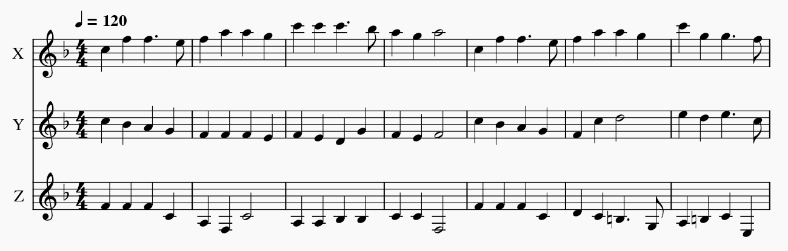

# musicxml-to-cnc
Convert musicxml files to g-code to play on a 3-axis CNC machine

## Usage
Use a music editing program to create a 3-voice score as shown. Each voice will be played by one of the motors of the CNC machine.

